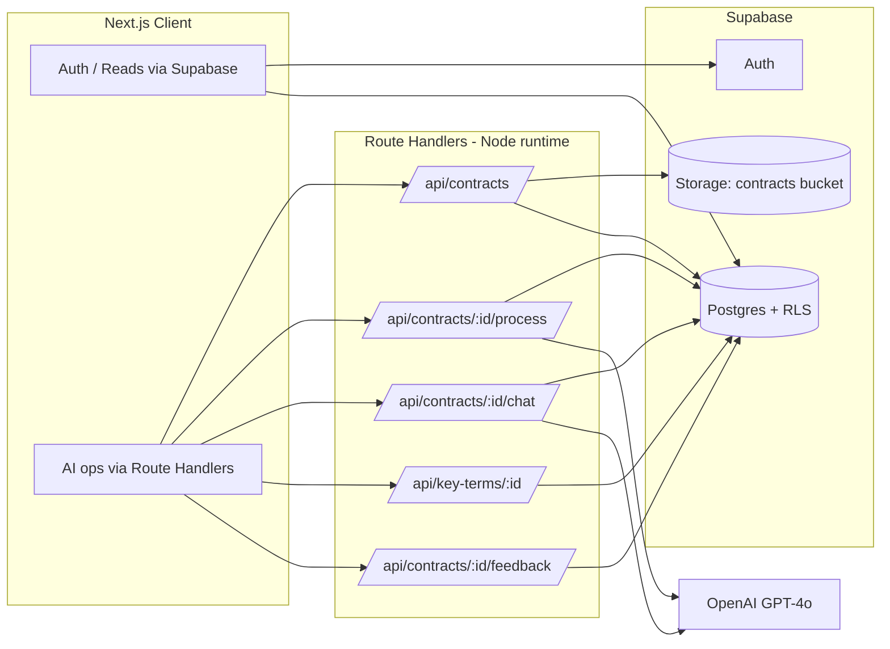
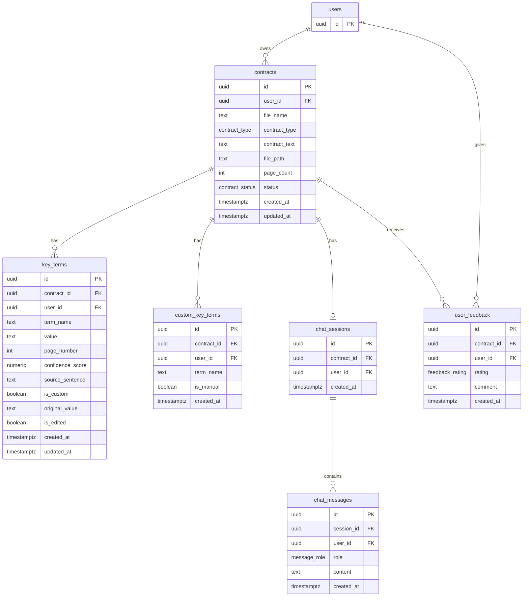

# ContractIQ — Engineering Document (High-Level Design)

**Version:** 1.0
**Date:** 2026-07-18
**Status:** Draft — pending approval (Stage 1)
**Source PRD:** `docs/ContractIQ_PRD.md` (v1.0, 2026-06-24)
**Design System:** `docs/design.md` (allNeurons — precision-first, data-dense)

> This is the authoritative High-Level Design for ContractIQ. It translates the approved PRD into concrete architecture, data models, APIs, and build phases. No implementation begins until this document is approved. Stage 2 (`/implementation-specs`) expands it into runnable specs (`docs/specs/*`, `supabase-schema.sql`, `.env.example`).

---

## Table of Contents

1. [Executive Summary](#1-executive-summary)
2. [Product Scope](#2-product-scope)
3. [User Personas](#3-user-personas)
4. [User Flows](#4-user-flows)
5. [Frontend Architecture](#5-frontend-architecture)
6. [Backend Architecture](#6-backend-architecture)
7. [Database Design & Schema](#7-database-design--schema)
8. [AI Architecture](#8-ai-architecture)
9. [API Specification](#9-api-specification)
10. [Feature Breakdown](#10-feature-breakdown)
11. [Folder Structure](#11-folder-structure)
12. [Naming Conventions](#12-naming-conventions)
13. [Testing Strategy](#13-testing-strategy)
14. [Specs → Implementation Mapping](#14-specs--implementation-mapping)
15. [Appendix A — Constraints & Non-Functional Requirements](#appendix-a--constraints--non-functional-requirements)

---

## 1. Executive Summary

**Project:** ContractIQ — an AI-assisted NDA/MSA review tool for SMBs and freelancers.

**Business goal:** Cut the time to understand an NDA or MSA from a 90-minute manual read to **≤ 15 minutes** end-to-end, without requiring a lawyer or legal training.

**Problem statement:** Founders, ops leads, and freelancers routinely sign NDAs and MSAs they do not fully understand. Manual review takes 90–120 minutes, misses material obligations (auto-renewal, indemnification caps, IP assignment), and ad-hoc legal review costs $250–$500/hr. Enterprise CLM tools are priced for legal teams; generic AI assistants give unstructured summaries with no page attribution, no confidence scoring, and no contract-type-specific term schema.

**What ContractIQ does:** Upload an NDA or MSA PDF → extract 10–30 key terms with **value, page number, confidence score, and the verbatim source sentence** → render the contract inline → chat with the document in plain English, with answers grounded strictly in the contract text.

**Target users:** (1) Time-Pressed Founder / Ops Lead at a 5–250 person company with no in-house legal; (2) Freelancer / Consultant signing client MSAs. See [§3](#3-user-personas).

**Success criteria (from PRD §3):**

| Dimension | Target |
|---|---|
| North Star — upload → completed review | ≤ 15 min (from 90 min baseline) |
| Extraction accuracy (F1) | ≥ 88% NDA / ≥ 85% MSA on labelled eval set |
| Time to first key-term display | ≤ 30 s P95 (≤ 20-page contract) |
| End-to-end extraction latency | ≤ 30 s P95 |
| Chat response latency | ≤ 15 s P95 |
| Cost per analysis | ≤ $0.25 (extraction ≤ $0.20) for a 20-page contract |
| Confidence calibration error | ≤ 0.10 |
| 30-day retention | ≥ 45% |
| AI correction rate | ≤ 12% of terms corrected |

**Core trust guarantee:** every AI output is grounded in the uploaded contract text — never the model's general legal knowledge. This is enforced at the architecture level (single stored source of truth), the prompt level (document-only system prompts + mandatory citations), and the UI level (confidence scores, source sentences, "not legal advice" disclaimer).

---

## 2. Product Scope

### 2.1 In Scope (MVP)

- **Auth:** Supabase email/password sign up / sign in / sign out; private per-user data.
- **Contract types:** NDA and MSA only.
- **Documents:** English-language, US/UK-law, **text-layer PDFs** only; ≤ 10 MB, ≤ 20 pages, ≤ 15,000 tokens.
- **Extraction:** standard term library per contract type + up to **5 custom terms** per analysis, each returning value, page number, confidence, source sentence.
- **Results UI:** two-panel layout — inline PDF viewer (with text-viewer fallback) + key-terms panel with colour-coded confidence.
- **Inline correction:** edit any extracted term; original AI value preserved for the feedback loop.
- **Chat:** document-grounded Q&A with mandatory `[Page X]` citations and persistent history.
- **Dashboard:** contract history with totals, type breakdown, sortable list.
- **Feedback:** thumbs up/down + optional comment per review.

### 2.2 Out of Scope (MVP) → mapped to roadmap

| Deferred capability | Target release |
|---|---|
| Export key terms to CSV / results to PDF | v1.1 |
| Batch upload (up to 5 contracts) | v1.1 |
| Dashboard analytics charts (by month, correction rate) | v1.1 |
| Scanned-PDF / OCR support (AWS Textract or equiv.) | v1.2 |
| Contract comparison (side-by-side) | v1.2 |
| Email notifications on completion | v1.2 |
| Multi-user / team workspace | v1.2 |
| Non-English / non-US-UK jurisdiction tuning | v1.2+ |
| Fine-tuned extraction model | v2 (post-launch) |
| Chunked / vector RAG for longer contracts | Post-v1.0 (when token limit raised) |

### 2.3 Explicit non-goals

ContractIQ does **not** provide legal advice, does not draft or redline contracts, does not take any action on a contract, and does not train any third-party model on user data. A "Not legal advice" disclaimer appears on every results page.

---

## 3. User Personas

At MVP there is a **single application role**: an authenticated **User** who owns and can only ever see their own data. There is no admin, reviewer, or team role — data isolation is enforced entirely by Supabase Row Level Security keyed on `user_id = auth.uid()`. (Team/multi-seat roles arrive with v1.2.)

| Persona | Profile | Responsibilities in-app | Permissions | Primary workflow |
|---|---|---|---|---|
| **Time-Pressed Founder / Ops Lead** (primary) | Founder / COO / Procurement / Legal-Ops at a 5–250-employee SaaS, agency, or fintech; no in-house legal. Signs 5–15 NDAs/MSAs per month. | Upload contracts, review extracted terms, add custom terms, correct values, chat, track history | Full CRUD on **own** contracts, terms, chat, feedback only | Review a contract → verify key terms → chat on edge cases → sign or push back |
| **Freelancer / Consultant** (secondary) | Designer / developer / marketer signing client MSAs; 1–4/month; cannot afford legal review. | Same as above; lighter volume | Same (own data only) | Spot non-standard / risky clauses before signing |

**Human-in-the-loop stance:** the AI *suggests and surfaces*; the human *decides*. No extraction is hidden, no action is auto-taken, and every value is traceable to a page and source sentence.

---

## 4. User Flows

Format: **User Action → Frontend Behavior → Backend Processing → Database Interaction → System Response**. Flows mirror PRD §4.

### 4.1 Flow 1 — New Visitor → Sign Up → Dashboard

1. **User Action:** Lands on marketing page, clicks "Get Started Free", submits email + password.
2. **Frontend:** Renders landing (`/`); opens auth form (`/login?mode=signup`); calls `supabase.auth.signUp()` directly from the client.
3. **Backend:** Supabase Auth issues the user record + session (JWT); email verification handled by Supabase.
4. **Database:** Row created in `auth.users` (Supabase-managed). No app tables written yet.
5. **System Response:** On success, redirect to `/dashboard`; empty state: *"No contracts reviewed yet — upload your first contract to begin."*

### 4.2 Flow 2 — Returning User → Dashboard

1. **User Action:** Clicks "Sign In", submits credentials.
2. **Frontend:** `supabase.auth.signInWithPassword()`; on success, `/dashboard` loads and fetches history via authenticated Supabase client (RLS-scoped).
3. **Backend:** None beyond Supabase Auth; reads go directly to Postgres under RLS.
4. **Database:** `SELECT` on `contracts WHERE user_id = auth.uid()` for totals, NDA/MSA breakdown, last 5 rows.
5. **System Response:** Summary cards (total processed, by type, last 5 with status + date) + prominent "Review a Contract" CTA.

### 4.3 Flow 3 — Core Flow: Contract Review

1. **User Action:** Clicks "Review Contract" → selects type (NDA/MSA) → drops/picks a PDF (≤ 10 MB / ≤ 20 pp) → optionally adds ≤ 5 custom terms → clicks "Process Contract".
2. **Frontend:** Upload screen (`/review`) validates file size/type client-side; on file select, POSTs the file to `POST /api/contracts`. While waiting, shows the **pre-processing preview** — the standard term list for the chosen type plus any "Custom"-badged terms. "Process Contract" calls `POST /api/contracts/[id]/process` and shows a 3-step progress indicator (extract text → analyse with AI → compile results).
3. **Backend:**
   - `POST /api/contracts` (Node runtime): auth check → validate size/pages/type → upload PDF to Supabase Storage (**non-blocking**) → `pdf-parse` extracts text with `[PAGE N]` markers → guard: if < 100 words, reject as scanned → persist contract row.
   - `POST /api/contracts/[id]/process`: set `status='processing'` → build the extraction prompt (standard + custom terms) → call GPT-4o (JSON mode, temp 0.1) → parse (single retry on bad JSON) → set `status='complete'` (or `'error'`).
4. **Database:** Insert `contracts` (with `contract_text`, `file_path`, `status`); insert `custom_key_terms` for user-added terms; insert one `key_terms` row per extracted term (value, page, confidence, source_sentence).
5. **System Response:** Redirect to `/contract/[id]` — two-panel results: **left** PDF viewer (or text-viewer fallback), **right** key-terms panel (Term | Value | Page | Confidence, colour-coded green ≥ 80 / amber 50–79 / red < 50). Low-confidence (< 50%) terms show ⚠️ + tooltip and auto-highlight the nearest page span. Each term has an expandable **"Why?"** showing the source sentence. Inline edit saves via `PATCH /api/key-terms/[id]`. "Not legal advice" disclaimer always present.

```mermaid
sequenceDiagram
    actor U as User
    participant FE as Next.js Client
    participant UP as POST /api/contracts
    participant PR as POST /api/contracts/[id]/process
    participant ST as Supabase Storage
    participant DB as Supabase Postgres
    participant AI as OpenAI GPT-4o

    U->>FE: Select type + PDF (+ custom terms)
    FE->>UP: multipart upload
    UP->>ST: put PDF (non-blocking)
    UP->>UP: pdf-parse → text w/ [PAGE N]
    alt text < 100 words
        UP-->>FE: 422 "Scanned PDFs not supported"
    else
        UP->>DB: insert contract (status=uploaded, contract_text)
        UP-->>FE: 201 {contract_id}
    end
    FE->>PR: process(contract_id)
    PR->>DB: status=processing
    PR->>DB: read contract_text + custom terms
    PR->>AI: extraction prompt (JSON mode, temp 0.1)
    AI-->>PR: JSON [ {term,value,page,confidence,source_sentence} ]
    PR->>DB: insert key_terms; status=complete (or error)
    PR-->>FE: 200 {status, terms}
    FE-->>U: Results page (PDF + key terms + chat)
```

### 4.4 Flow 4 — Chat with Contract

1. **User Action:** On the results page, opens the Chat tab and types a question ("Is there an auto-renewal clause?").
2. **Frontend:** Renders chat panel; POSTs to `POST /api/contracts/[id]/chat` with the question; optimistically shows the user message.
3. **Backend:** Auth check → load full `contract_text` + full conversation history (ascending, up to 200) → classify query (`contract`/`history`/`both`) to shape the system prompt → call GPT-4o (temp 0.4, ≤ 1k out) with a document-only system prompt → enforce `[Page X]` citation and "Based on the document…" framing → persist both messages.
4. **Database:** Ensure a `chat_sessions` row for the contract; insert user + assistant rows into `chat_messages` (role, content, timestamp).
5. **System Response:** Assistant reply appears left-aligned with a "Source: Page X" citation linking to that page in the viewer. If the answer is absent, the model returns "I cannot find this in the document." Reopening the contract reloads the saved session.

---

## 5. Frontend Architecture

### 5.1 Stack

- **Framework:** Next.js 14 (App Router), React 18, TypeScript.
- **Styling:** Tailwind CSS, with the token scale from `docs/design.md` mapped into `tailwind.config.ts` (primitive palette → semantic tokens → components). Greyscale by default; colour reserved for state (confidence tiers, status).
- **PDF rendering:** `pdfjs-dist` (PDF.js) client-side, lazy page loading.
- **Server state:** TanStack Query (React Query) for fetching/caching contracts, terms, and messages. **Local UI state** via React hooks/context — no heavy global store (Redux/Zustand) at MVP.
- **Auth on client:** `@supabase/ssr` browser client for auth + RLS-scoped reads; session persisted in cookies.

### 5.2 Route tree (App Router)

```
app/
  layout.tsx                 # root layout, providers (Query, Supabase, Theme)
  page.tsx                   # "/"        Landing (marketing, static) — Server Component
  login/page.tsx             # "/login"   Sign in / sign up — Client Component
  dashboard/page.tsx         # "/dashboard" History + summary — Server Component + client list
  review/page.tsx            # "/review"  Type select + upload + custom terms — Client Component
  contract/[id]/page.tsx     # "/contract/[id]" Results: PDF + terms + chat — Server shell + client panels
  api/…                      # Route Handlers (see §6, §9)
middleware.ts                # session refresh + protected-route redirect
```

**Server vs Client components:** marketing landing and the dashboard shell render on the server (fast first paint, SEO on `/`). Interactive surfaces — upload/drag-drop, PDF viewer, key-terms panel with inline edit, chat — are Client Components. Protected routes (`/dashboard`, `/review`, `/contract/*`) are gated by `middleware.ts` (redirect to `/login` if no session).

### 5.3 Component hierarchy (key components)

```
<AppProviders> (Query + Supabase + Theme)
├─ Landing:      <Hero> <DemoGif> <CTAButtons>
├─ Auth:         <AuthForm mode="signin|signup">
├─ Dashboard:    <SummaryCards> <ContractTable sortable> <EmptyState>
├─ Review:       <ContractTypeSelect> <PdfDropzone> <PreProcessingPreview>
│                  └─ <StandardTermList> <CustomTermAdder max=5> <ProcessButton>
│                <ProcessingProgress steps=[extract, analyse, compile]>
└─ Contract/[id] (results):
   ├─ Left:      <ContractViewer targetPage>       # PDF.js primary
   │               └─ <TextViewerFallback>          # renders [PAGE N] sections when Storage unavailable
   ├─ Right:     <KeyTermsPanel>
   │               └─ <KeyTermRow value|page|confidence>
   │                    ├─ <ConfidenceBadge tier=green|amber|red>
   │                    ├─ <LowConfidenceWarning>   # ⚠️ + tooltip when <50%
   │                    ├─ <WhyExpander source_sentence>
   │                    └─ <InlineEditField>         # PATCH on save, "Edited" badge
   ├─ Chat:      <ChatPanel> <MessageList> <MessageInput> <PageCitationLink>
   ├─ <FeedbackWidget thumbs + comment>
   └─ <LegalDisclaimer>  # always visible
```

### 5.4 Viewer contract (FR-06 / FR-07)

Both `<ContractViewer>` (PDF.js) and `<TextViewerFallback>` accept a `targetPage` prop and expose identical page-navigation behavior. Clicking a page reference in `<KeyTermsPanel>` sets `targetPage`, which scrolls the active viewer to that page and visually highlights the referenced span. The fallback parses `[PAGE N]` markers from `contracts.contract_text` and renders each page as a labelled section — so contract content is **always** viewable even if Storage/signed-URL is unavailable.

### 5.5 UX states

| State | Handling |
|---|---|
| Loading | Skeletons on dashboard/terms; 3-step progress bar during processing |
| Empty | Dashboard "no contracts" empty state; chat "ask your first question" |
| Error | Upload rejection (size/pages/scanned), OpenAI timeout → human-readable message + "Try again" CTA (contract left in `error` status, re-processable without re-upload) |
| Low-confidence | ⚠️ badge + non-dismissible tooltip; auto-highlight page span |
| Responsive | Two-panel collapses to stacked/tabbed on narrow viewports; desktop-recommended banner on mobile |
| Accessibility | WCAG 2.1 AA — keyboard nav, focus rings, ARIA on interactive rows/tabs, colour is never the *only* signal (icons accompany confidence tiers), contrast per design tokens |

---

## 6. Backend Architecture

### 6.1 Shape

The backend is a **thin orchestration layer** implemented as **Next.js App Router Route Handlers** running on Vercel serverless functions with the **Node.js runtime** (required by `pdf-parse`). No standalone server. Business logic lives in `lib/` services; route handlers only authenticate, validate, call a service, and shape the response. The OpenAI API key is **server-only** and never reaches the client.

**Runtime configuration:** AI-heavy handlers export `export const runtime = 'nodejs'` and `export const maxDuration = 60` to fit the ≤ 30 s P95 extraction budget within Vercel Pro limits.

### 6.2 Layers

```
Route Handler (auth → validate → orchestrate → respond)
   ├─ lib/supabase/server.ts      # RLS-scoped server client (user JWT)
   ├─ lib/supabase/admin.ts       # service-role client (SERVER ONLY; storage, privileged writes)
   ├─ lib/pdf/extract.ts          # pdf-parse → text with [PAGE N] markers + scanned guard
   ├─ lib/openai/extract.ts       # build prompt, call GPT-4o JSON mode, parse w/ 1 retry
   ├─ lib/openai/chat.ts          # query classify + document-only chat, citation enforcement
   ├─ lib/validation/*.ts         # zod schemas for every request body
   └─ lib/errors.ts               # typed error → HTTP mapping, no silent failures
```

### 6.3 Core systems

- **Auth:** Supabase session validated on every route handler via the SSR server client; `middleware.ts` refreshes the session and gates protected pages.
- **Authorization:** enforced primarily by **RLS** (`user_id = auth.uid()`), with a defense-in-depth `user_id` check in handlers before mutations.
- **Validation:** `zod` schemas validate every request body/params; reject with `400` + field errors.
- **Business logic / orchestration:** extraction and chat services (see §8).
- **Error handling & resilience:**
  - OpenAI: **3 retries with exponential backoff**; on exhaustion, set `contracts.status='error'` and return a human-readable message + retryable flag. **No silent failures.**
  - JSON parse: **single automatic retry** with a "return only JSON" corrective prompt before erroring.
  - Storage: **non-blocking** — a failed PDF upload leaves `file_path = null`; the AI pipeline (which reads `contract_text` from the DB) is unaffected; only the PDF viewer is hidden and the text-viewer fallback is used.
- **Rate limiting:** per-user throttle on `POST …/process` and `…/chat` (protects the OpenAI budget/quota); see §8.6.

### 6.4 Service interaction



---

## 7. Database Design & Schema

Single Supabase Postgres project. Every application table carries a `user_id` FK to `auth.users` and has **RLS enabled** with policies restricting all operations to `user_id = auth.uid()`. `auth.users` is Supabase-managed. Full SQL (tables, indexes, triggers, RLS, Storage bucket + policies) is produced in **Stage 2** as `docs/specs/supabase-schema.sql`; this section defines intent.

### 7.1 ER diagram



### 7.2 Enums

| Enum | Values |
|---|---|
| `contract_type` | `nda`, `msa` |
| `contract_status` | `uploaded`, `processing`, `complete`, `error` |
| `message_role` | `user`, `assistant` |
| `feedback_rating` | `up`, `down` |

### 7.3 Tables

#### `contracts`
Purpose: one row per uploaded contract; holds the canonical extracted text (source of truth for AI + chat).

| Column | Type | Notes |
|---|---|---|
| `id` | `uuid` PK | `gen_random_uuid()` |
| `user_id` | `uuid` FK → `auth.users(id)` | `on delete cascade`; not null |
| `file_name` | `text` | original filename; not null |
| `contract_type` | `contract_type` | not null |
| `contract_text` | `text` | full text with `[PAGE N]` markers; not null |
| `file_path` | `text` | Storage path `contracts/{user_id}/{contract_id}/{filename}.pdf`; **nullable** (null if Storage upload failed) |
| `page_count` | `int` | ≤ 20 enforced at upload |
| `status` | `contract_status` | default `uploaded` |
| `created_at` / `updated_at` | `timestamptz` | `now()`; `updated_at` via trigger |

Indexes: `(user_id)`, `(user_id, created_at desc)`, `(status)`.
Constraints: `page_count between 1 and 20`.

#### `key_terms`
Purpose: one row per extracted term (standard or custom), with attribution and correction history.

| Column | Type | Notes |
|---|---|---|
| `id` | `uuid` PK | |
| `contract_id` | `uuid` FK → `contracts(id)` | `on delete cascade`; not null |
| `user_id` | `uuid` FK → `auth.users(id)` | denormalized for RLS; not null |
| `term_name` | `text` | not null |
| `value` | `text` | current (possibly edited) value |
| `page_number` | `int` | 1-indexed |
| `confidence_score` | `numeric(4,3)` | 0.000–1.000 |
| `source_sentence` | `text` | verbatim supporting sentence |
| `is_custom` | `boolean` | default false |
| `original_value` | `text` | AI's original value, preserved on edit (feedback loop) |
| `is_edited` | `boolean` | default false; drives "Edited" badge |
| `created_at` / `updated_at` | `timestamptz` | `updated_at` via trigger |

Indexes: `(contract_id)`, `(user_id)`.
Constraint: `confidence_score between 0 and 1`; `page_number >= 1`.

#### `custom_key_terms`
Purpose: user-defined terms (≤ 5) captured at the preview step, before extraction, so the request that the user asked for is auditable even if extraction returns nothing for a term.

| Column | Type | Notes |
|---|---|---|
| `id` | `uuid` PK | |
| `contract_id` | `uuid` FK → `contracts(id)` | cascade; not null |
| `user_id` | `uuid` FK | not null |
| `term_name` | `text` | not null |
| `is_manual` | `boolean` | default true |
| `created_at` | `timestamptz` | |

Constraint: at most 5 rows per `contract_id` (enforced in app + optional trigger). Index: `(contract_id)`.

#### `chat_sessions`
Purpose: one chat thread per contract (MVP: single session).

| Column | Type | Notes |
|---|---|---|
| `id` | `uuid` PK | |
| `contract_id` | `uuid` FK → `contracts(id)` | cascade; not null; **unique** (one session per contract at MVP) |
| `user_id` | `uuid` FK | not null |
| `created_at` | `timestamptz` | |

Index: `(contract_id)`.

#### `chat_messages`
Purpose: full conversation log (passed back to the model, ascending, up to 200/turn).

| Column | Type | Notes |
|---|---|---|
| `id` | `uuid` PK | |
| `session_id` | `uuid` FK → `chat_sessions(id)` | cascade; not null |
| `user_id` | `uuid` FK | not null |
| `role` | `message_role` | not null |
| `content` | `text` | not null |
| `created_at` | `timestamptz` | drives ascending order |

Index: `(session_id, created_at asc)`, `(user_id)`.

#### `user_feedback`
Purpose: thumbs + optional comment per review.

| Column | Type | Notes |
|---|---|---|
| `id` | `uuid` PK | |
| `contract_id` | `uuid` FK → `contracts(id)` | cascade; not null |
| `user_id` | `uuid` FK | not null |
| `rating` | `feedback_rating` | not null |
| `comment` | `text` | nullable |
| `created_at` | `timestamptz` | |

Index: `(contract_id)`, `(user_id)`.

### 7.4 Storage (FR-14)

- Bucket **`contracts`** (private), created via SQL (`INSERT INTO storage.buckets`) in Stage 2.
- Path pattern: `contracts/{user_id}/{contract_id}/{filename}.pdf`.
- Storage RLS via `CREATE POLICY ON storage.objects` for **INSERT / SELECT / DELETE**, each restricting to `auth.uid()::text = (storage.foldername(name))[1]`.
- Access via **1-hour signed URLs** for the PDF viewer. Upload is non-blocking (see §6.3).

### 7.5 Triggers & retention

- `updated_at` auto-update trigger on `contracts` and `key_terms`.
- **Retention:** PDFs auto-deleted 90 days after last access (scheduled job — implementation in Stage 2 / Stage 7); users can delete a contract and all associated data on demand (cascade). `contract_text` is deleted with the row.

---

## 8. AI Architecture

### 8.1 Provider & model

| Item | Choice | Rationale |
|---|---|---|
| Provider / model | **OpenAI GPT-4o** | Best-in-class legal-text reasoning; JSON mode; ≥ 128k context |
| Response format | JSON mode (`response_format: { type: "json_object" }`) for extraction | Eliminates unparseable output |
| Extraction params | temp **0.1**, max **2,000** output tokens | Deterministic structured extraction |
| Chat params | temp **0.4**, max **1,000** output tokens | Slightly warmer, concise answers |
| Context | Full contract text (≤ 15k tokens); no chunking/vector RAG at MVP | Guarantees no clause missed by retrieval error |
| Fallback | Evaluate Claude / Gemini if cost > 2× budget (roadmap risk item) | Cost hedge |

### 8.2 Extraction strategy

- **Few-shot prompt:** 3 labelled NDA + 3 labelled MSA examples in the system prompt establish the schema and clause-variant handling.
- **Standard term library** injected per contract type:
  - **NDA:** Parties, Effective Date, Confidentiality Obligations, Permitted Disclosures, Term & Duration, Governing Law, Jurisdiction, IP Ownership, Non-Solicitation, Breach & Remedy.
  - **MSA:** Parties, Service Scope, Payment Terms, Invoice Schedule, Late Payment Penalty, Liability Cap, Indemnification, IP Ownership, Termination Clause, Governing Law, Dispute Resolution, Notice Period.
- **Custom terms** (≤ 5) appended to the target list; extracted with the identical schema (zero-shot on the term name).
- **Output schema** (JSON array):
  ```json
  [{ "term_name": "string", "value": "string",
     "page_number": 1, "confidence_score": 0.0,
     "source_sentence": "string" }]
  ```
- **Confidence** is self-reported by the model in the same pass (no second inference call).

### 8.3 Chat strategy (grounded Q&A)

- Passes **full `contract_text`** + **full conversation history** (ascending, up to 200 messages) on every turn — enables memory-style questions.
- **Query classification** (`contract` / `history` / `both`) adjusts the system prompt and context inclusion **without an extra API call** (done in the same prompt scaffold).
- **System prompt:** *"Answer only from the document text provided. If the answer is not in the document, say 'I cannot find this in the document.' Prefix answers with 'Based on the document…' and include a `[Page X]` citation."*
- **Mandatory `[Page X]` citation** on every response; "cannot find" is a valid, expected answer.

### 8.4 Grounding contract (trust guarantee)

- **Single source of truth:** text extracted once at upload into `contracts.contract_text`; both extraction and chat read from it — the model never sees anything but the user's own document.
- **Traceability:** every extracted term carries `source_sentence` + 1-indexed `page_number` (surfaced in "Why?").
- **No training on user data**; OpenAI called with the `user` parameter and no training opt-in (GDPR DPA required before EU onboarding).

### 8.5 Hallucination guardrails (PRD §9)

| Layer | Control |
|---|---|
| Extraction | Confidence per term; < 50% → ⚠️ + non-dismissible tooltip (term never hidden); source-sentence required; temp 0.1 + JSON mode; monthly calibration check (UI warning if ≥ 15% miscalibration) |
| Chat | Document-only system prompt; mandatory page citation; "Based on the document…" framing; automated "topic-not-in-doc → I cannot find this" regression test |
| UI / human-in-loop | Inline correction (original value preserved); auto-highlight nearest page span for low-confidence terms; "Not legal advice" disclaimer on every results page |

### 8.6 Token, cost & rate controls

- **Budget math (PRD §6):** ~15k input + ~1.5k output ≈ **$0.097/analysis** at GPT-4o pricing → within the ≤ $0.20 extraction / ≤ $0.25 total ceiling.
- **Hard limits:** reject contracts > 15,000 tokens / > 20 pages / > 10 MB before any OpenAI call.
- **Rate limiting:** per-user throttle on `process` and `chat`; monthly cost alerting at 80% of budget threshold.
- **Retries:** 3× exponential backoff on OpenAI errors; single JSON-parse retry; on exhaustion → `status='error'` + retryable message.

---

## 9. API Specification

All routes are Next.js Route Handlers under `app/api/`. Unless noted, **auth is required** (Supabase session); the handler resolves `user_id` from the session and all DB access is RLS-scoped. Errors use a consistent envelope: `{ "error": { "code": string, "message": string, "retryable"?: boolean, "fields"?: object } }`.

Client-side **reads** for dashboard/history/terms/messages may also go **directly to Supabase** under RLS (React Query); the `GET` endpoints below exist for server-render and parity.

### 9.1 `POST /api/contracts` — upload + text extraction
- **Purpose:** Store PDF, extract text with `[PAGE N]`, create the contract row. (US-002, FR-02/03, runtime: `nodejs`.)
- **Request:** `multipart/form-data` — `file` (PDF ≤ 10 MB), `contract_type` (`nda|msa`), `custom_terms?` (JSON array ≤ 5).
- **Validation:** size ≤ 10 MB; pages ≤ 20; tokens ≤ 15,000; extracted text ≥ 100 words (else scanned).
- **Response `201`:** `{ "contract_id": uuid, "status": "uploaded", "page_count": int, "viewer_available": boolean }`.
- **Errors:** `400` invalid type/body; `413` too large; `422` `SCANNED_PDF` ("Scanned PDFs are not supported yet") / `CONTRACT_TOO_LONG`; `401` unauthenticated.

### 9.2 `POST /api/contracts/[id]/process` — key-term extraction
- **Purpose:** Run GPT-4o extraction over stored text + custom terms; persist terms. (US-003/004/005, FR-04/05/11, runtime: `nodejs`, `maxDuration=60`.)
- **Request:** body optional `{ }` (custom terms already stored at upload); path `id`.
- **Behavior:** set `status='processing'` → extract → parse (1 retry) → insert `key_terms` → `status='complete'|'error'`.
- **Response `200`:** `{ "status": "complete", "terms": [ { "id", "term_name", "value", "page_number", "confidence_score", "source_sentence", "is_custom" } ] }`.
- **Errors:** `404` not found / not owner; `409` already processing; `502` `OPENAI_FAILED` (`retryable: true`, contract left in `error`); `401`.

### 9.3 `GET /api/contracts` — history
- **Purpose:** Dashboard list + summary. (US-008, FR-10.)
- **Query:** `?sort=created_at|file_name|contract_type&order=asc|desc`.
- **Response `200`:** `{ "totals": { "all": int, "nda": int, "msa": int }, "contracts": [ { "id", "file_name", "contract_type", "status", "created_at" } ] }`.

### 9.4 `GET /api/contracts/[id]` — results payload
- **Response `200`:** `{ "contract": {...}, "key_terms": [...], "viewer_available": boolean, "signed_url": string|null }` (1-hour signed URL when Storage available).
- **Errors:** `404`, `401`.

### 9.5 `PATCH /api/key-terms/[id]` — inline edit
- **Purpose:** Correct a term value; preserve original for feedback loop. (US-009, FR-04; must save ≤ 2 s.)
- **Request:** `{ "value": string }`.
- **Behavior:** if `is_edited=false`, copy current `value` → `original_value`; set `value`, `is_edited=true`.
- **Response `200`:** updated term object with `is_edited: true`.
- **Errors:** `400` empty value; `404`; `401`.

### 9.6 `POST /api/contracts/[id]/chat` — grounded Q&A
- **Purpose:** Document-grounded answer + persist messages. (US-007/012, FR-08/09, runtime: `nodejs`; ≤ 15 s P95.)
- **Request:** `{ "message": string }`.
- **Behavior:** ensure `chat_sessions` row → load full history (asc, ≤ 200) + `contract_text` → classify query → GPT-4o (temp 0.4) → insert user + assistant messages.
- **Response `200`:** `{ "message": { "id", "role": "assistant", "content", "created_at" }, "citation_page": int|null }`.
- **Errors:** `404`; `502` `OPENAI_FAILED` (`retryable`); `429` rate-limited; `401`.

### 9.7 `GET /api/contracts/[id]/messages` — chat history
- **Response `200`:** `{ "session_id": uuid|null, "messages": [ { "id", "role", "content", "created_at" } ] }` (ascending).

### 9.8 `POST /api/contracts/[id]/feedback` — rating
- **Purpose:** Thumbs + optional comment. (US-010, FR-12.)
- **Request:** `{ "rating": "up|down", "comment"?: string }`.
- **Response `201`:** feedback object. **Errors:** `400`, `404`, `401`.

### 9.9 `DELETE /api/contracts/[id]` — delete contract + data
- **Purpose:** GDPR on-demand deletion. Cascades terms, custom terms, chat, feedback; deletes Storage object.
- **Response `204`.** **Errors:** `404`, `401`.

> **Export endpoints (CSV/PDF, US-011) and batch upload are Phase 3** — not specified here.

---

## 10. Feature Breakdown

Priorities and points from PRD §3; acceptance criteria condensed from PRD §4. Phases map to the PRD roadmap (v0.1–v1.2).

### 10.1 Phase 1 — MVP core (roadmap v0.1–v0.3)

| ID | Feature | Acceptance criteria (condensed) | Dependencies |
|---|---|---|---|
| US-001 | Email/password auth (P0) | Auth completes ≤ 10 s; redirect to dashboard on success; clear error on invalid creds | Supabase Auth |
| US-002 | PDF upload + text extraction (P0) | Accepts ≤ 10 MB; extraction ≤ 30 s P95 for ≤ 20 pp; ≥ 80% of standard terms shown | Storage bucket, `pdf-parse`, `contracts` table |
| US-003 | Page attribution per term (P0) | Each term shows a page number; clicking scrolls viewer to page | US-002, viewer |
| US-004 | Confidence score per term (P0) | 0–100% shown; < 50% shows ⚠️ + tooltip | US-002 |
| US-005 | Custom key terms (≤ 5) before processing (P0) | Appear in preview with "Custom" badge; results carry value/page/confidence | US-002, `custom_key_terms` |
| US-011-partial | Key-terms panel with value display (P0) | Panel shows Term / Value / Page / Confidence per term | US-002/003/004 |
| FR-11 | Low-confidence warning (P0) | < 50% never hidden; ⚠️ + verify-tooltip; page auto-highlight | US-004 |

**v0.1 (Foundation/MEP):** Supabase project + all tables; static landing; auth; redirect to dashboard; empty dashboard state.
**v0.2 (Core Review):** upload + type selector; `pdf-parse`; GPT-4o extraction (standard terms); key-terms panel; confidence warnings; results persisted.
**v0.3 (Enriched):** pre-processing preview; custom terms; PDF.js viewer; click-to-navigate; source-sentence "Why?" tooltip.

### 10.2 Phase 2 — Chat, history & correction (roadmap v0.4)

| ID | Feature | Acceptance criteria | Dependencies |
|---|---|---|---|
| US-006 | Inline PDF viewer (P1) | Renders all pages; scroll + zoom; clickable term refs; text-viewer fallback | PDF.js, signed URL |
| US-007 | Chat with contract (P1) | Responds ≤ 15 s; grounded in document; every reply cites a page | `contract_text`, chat tables |
| US-008 | Dashboard history (P1) | Name/type/date/status; sortable; row opens results | `contracts` table |
| US-009 | Inline term editing (P1) | Saves ≤ 2 s; "Edited" badge; original value preserved | `key_terms.original_value` |
| US-012 | Persistent chat history (P1) | Messages stored; reopening loads prior session | chat tables |

### 10.3 Phase 3 — Launch hardening & growth (roadmap v1.0–v1.2)

| ID / item | Feature | Notes |
|---|---|---|
| US-010 | Feedback thumbs + comment (P2) | `user_feedback` table |
| US-011 | Export terms CSV / results PDF (P2) | v1.1 |
| — | Batch upload (≤ 5) | v1.1 |
| — | Dashboard analytics charts | v1.1 |
| — | OCR / scanned PDFs | v1.2 |
| — | Contract comparison; email notifications; team workspace | v1.2 |
| — | Security audit, rate limiting, WCAG review, perf optimisation | v1.0 (see Stage 7 `/security-foundation`) |

---

## 11. Folder Structure

```
contractiq/
├─ app/
│  ├─ layout.tsx                     # root layout + providers
│  ├─ page.tsx                       # "/" landing (marketing)
│  ├─ login/page.tsx                 # auth
│  ├─ dashboard/page.tsx             # history + summary
│  ├─ review/page.tsx                # upload + custom terms
│  ├─ contract/[id]/page.tsx         # results (PDF + terms + chat)
│  └─ api/
│     ├─ contracts/route.ts          # POST (upload+extract), GET (list)
│     ├─ contracts/[id]/route.ts     # GET (results), DELETE
│     ├─ contracts/[id]/process/route.ts
│     ├─ contracts/[id]/chat/route.ts
│     ├─ contracts/[id]/messages/route.ts
│     ├─ contracts/[id]/feedback/route.ts
│     └─ key-terms/[id]/route.ts     # PATCH (inline edit)
├─ components/
│  ├─ auth/                          # AuthForm
│  ├─ dashboard/                     # SummaryCards, ContractTable, EmptyState
│  ├─ review/                        # ContractTypeSelect, PdfDropzone, PreProcessingPreview, CustomTermAdder
│  ├─ contract/                      # ContractViewer, TextViewerFallback, KeyTermsPanel, KeyTermRow, WhyExpander
│  ├─ chat/                          # ChatPanel, MessageList, MessageInput
│  └─ ui/                            # design-system primitives (Button, Badge, Tooltip…)
├─ lib/
│  ├─ supabase/                      # server.ts, admin.ts, client.ts
│  ├─ pdf/                           # extract.ts (pdf-parse + [PAGE N])
│  ├─ openai/                        # extract.ts, chat.ts, prompts/
│  ├─ validation/                    # zod schemas
│  ├─ security/                      # (Stage 7) rate limiting, input sanitisation
│  └─ errors.ts
├─ docs/
│  ├─ ContractIQ_PRD.md
│  ├─ design.md
│  ├─ engineering/engineering-doc.md # THIS FILE
│  └─ specs/                         # (Stage 2)
├─ supabase/
│  └─ schema.sql                     # (Stage 2 source; also docs/specs/supabase-schema.sql)
├─ tests/                            # unit / integration / e2e / eval
├─ middleware.ts                     # session refresh + route protection
├─ tailwind.config.ts               # design tokens from docs/design.md
├─ .env.example                     # (Stage 2)
└─ next.config.mjs
```

---

## 12. Naming Conventions

| Element | Convention | Example |
|---|---|---|
| Folders | kebab-case | `key-terms/`, `contract/[id]/` |
| React components (files) | PascalCase | `KeyTermsPanel.tsx`, `ContractViewer.tsx` |
| Hooks | `useX` camelCase | `useContract.ts`, `useChat.ts` |
| Services / lib modules | camelCase | `extract.ts`, `chat.ts`, `errors.ts` |
| Route handlers | `route.ts` in a resource folder | `app/api/contracts/[id]/process/route.ts` |
| API paths | kebab-case, plural resources | `/api/contracts`, `/api/key-terms/[id]` |
| DB tables | snake_case, plural | `contracts`, `key_terms`, `chat_messages` |
| DB columns | snake_case | `contract_text`, `confidence_score`, `is_edited` |
| Enums | snake_case type, lower values | `contract_status` → `processing` |
| Env vars | SCREAMING_SNAKE_CASE; `NEXT_PUBLIC_` only if browser-safe | `OPENAI_API_KEY` (server only), `NEXT_PUBLIC_SUPABASE_URL` |
| Zod schemas | `xxxSchema` | `uploadContractSchema` |
| TS types/interfaces | PascalCase | `KeyTerm`, `ContractStatus` |

---

## 13. Testing Strategy

| Layer | Scope | Framework | Target |
|---|---|---|---|
| **Unit** | `pdf` extraction ([PAGE N] parsing, scanned guard), OpenAI JSON parsing + retry, confidence/colour mapping, zod validators, viewer `targetPage` logic | Vitest (or Jest) + Testing Library | ≥ 80% on `lib/` |
| **Integration** | Route handlers against a test Supabase (or local) with **OpenAI mocked**; RLS enforcement; upload → extract → persist; chat persistence | Vitest + Supabase test project | All endpoints in §9 |
| **E2E** | Auth (signup/signin/signout); upload → results; inline edit; chat with citation; **cross-user RLS isolation** (User B cannot read User A's contract) | Playwright | Critical paths green in CI |
| **AI eval suite** | Offline accuracy on labelled set (30 NDA + 20 MSA + CUAD): F1, confidence calibration, page-number accuracy, custom-term F1, chat groundedness | Custom eval harness (see PRD §10) | F1 ≥ 88% NDA / ≥ 85% MSA; calibration ≤ 0.10; page ≥ 92%; hallucinated chat ≤ 5% |
| **Regression** | Hallucination test: question about a topic absent from the doc → expect "I cannot find this"; runs every deploy | Vitest + fixture contract | Must pass to ship |

**CI gates:** RLS cross-user test and the hallucination regression are **release-blocking**. Coverage and the AI eval suite run every release; calibration drift and correction-rate alerts (> 12% in a 7-day window) trigger a prompt review.

---

## 14. Specs → Implementation Mapping

Traces each PRD requirement to the concrete files that will implement it. (Full flow: PRD → this doc → Stage 2 spec → code.)

| Requirement | User story | API / route | Frontend | Service / lib | DB |
|---|---|---|---|---|---|
| Auth | US-001 / FR-01 | Supabase Auth (client) + `middleware.ts` | `login/page.tsx`, `AuthForm` | `lib/supabase/*` | `auth.users` |
| Upload + extract text | US-002 / FR-02 / FR-03 | `POST /api/contracts` | `PdfDropzone`, `ContractTypeSelect` | `lib/pdf/extract.ts` | `contracts` |
| Custom terms | US-005 / FR-05 | `POST /api/contracts` (custom_terms) | `CustomTermAdder`, `PreProcessingPreview` | validation | `custom_key_terms` |
| Key-term extraction | US-002/003/004 / FR-04 | `POST /api/contracts/[id]/process` | `KeyTermsPanel`, `KeyTermRow` | `lib/openai/extract.ts` | `key_terms` |
| Confidence + low-conf warning | US-004 / FR-11 | (in process response) | `ConfidenceBadge`, `LowConfidenceWarning` | confidence mapping | `key_terms.confidence_score` |
| Page attribution + navigation | US-003 / FR-07 | `GET /api/contracts/[id]` | `ContractViewer`/`TextViewerFallback` (`targetPage`) | — | `key_terms.page_number` |
| Inline PDF viewer + fallback | US-006 / FR-06 | signed URL in `GET /api/contracts/[id]` | `ContractViewer`, `TextViewerFallback` | `lib/supabase/admin.ts` (signed URL) | `contracts.file_path` / `contract_text` |
| Inline edit | US-009 | `PATCH /api/key-terms/[id]` | `InlineEditField` | validation | `key_terms.original_value/is_edited` |
| Chat | US-007 / FR-08 / FR-09 | `POST /api/contracts/[id]/chat`, `GET …/messages` | `ChatPanel`, `MessageList` | `lib/openai/chat.ts` | `chat_sessions`, `chat_messages` |
| Persistent chat | US-012 | `GET …/messages` | `ChatPanel` load | — | `chat_messages` |
| Dashboard history | US-008 / FR-10 | `GET /api/contracts` | `SummaryCards`, `ContractTable` | — | `contracts` |
| Feedback | US-010 / FR-12 | `POST /api/contracts/[id]/feedback` | `FeedbackWidget` | — | `user_feedback` |
| RLS isolation | FR-13 | all handlers | — | `lib/supabase/server.ts` | RLS on all tables |
| Single-file SQL setup | FR-14 | — | — | — | `docs/specs/supabase-schema.sql` (Stage 2) |
| Delete / GDPR | Constraints §5 | `DELETE /api/contracts/[id]` | dashboard action | `lib/supabase/admin.ts` | cascade + Storage |

---

## Appendix A — Constraints & Non-Functional Requirements

**Performance (PRD §5):** end-to-end extraction ≤ 30 s P95 (≤ 20 pp); first key-term ≤ 30 s P95; chat ≤ 15 s P95; each OpenAI call ≤ 20 s P95; inline edit ≤ 2 s; export ≤ 5 s (Phase 3); auth ≤ 10 s.

**Upload/document limits:** ≤ 10 MB, ≤ 20 pages, ≤ 15,000 tokens; text-layer PDFs only (scanned → graceful error when text < 100 words); NDA/MSA English US/UK only; ≤ 5 custom terms.

**Cost:** ≤ $0.25/analysis (extraction ≤ $0.20); monthly cost alerting at 80% of budget.

**Scalability:** 100 concurrent analyses in beta without degradation; architecture supports horizontal scaling to 1,000 concurrent users (serverless route handlers + Supabase Pro).

**Reliability & security:** 99.5% uptime; OpenAI errors caught + human-readable + retryable (no silent failures); PDFs via 1-hour signed URLs, Storage non-blocking; AES-256 at rest, TLS 1.3 in transit; RLS on all tables. Full security controls are delivered in **Stage 7** (`/security-foundation`).

**Usability & compliance:** usable by a non-lawyer with no training; legal jargon tooltipped; WCAG 2.1 AA; 90-day PDF retention then auto-delete; on-demand user deletion; GDPR-ready (DPA with Supabase + OpenAI before EU onboarding; no third-party model training on user data).

**"Not legal advice"** disclaimer on every results page; "Powered by OpenAI GPT-4o" attribution in the footer.

---

### Open items / assumptions to validate (from PRD §13)

- `[TBD-eval-set]` — 50 SME-labelled contracts (30 NDA + 20 MSA) must exist before beta; otherwise CUAD-only reduces eval confidence.
- `[TBD-dpa]` — GDPR Article 28 DPA with OpenAI + Supabase required before EU onboarding.
- Assumed GPT-4o achieves ≥ 82% F1 few-shot (launch threshold); if false, evaluate a fine-tuned or alternative model before v0.2.
- Assumed Supabase RLS alone isolates user data (no custom auth middleware) — **must be verified by the Stage 7 security review**.
